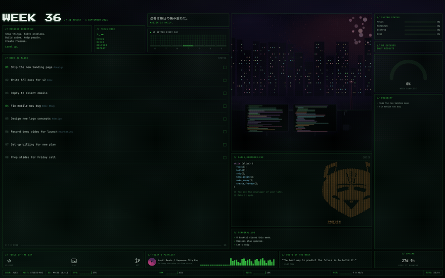

# weekboard

A terminal to-do list that redraws itself as your desktop wallpaper every time you
change something — tasks, gauges, quote of the week, all of it, live on your desktop
instead of buried in another app.



*(demo data — `examples/sample-week.json` has the file this was rendered from; the GIF is
just that same week with tasks checked off in sequence, one render per state — a
[static screenshot](docs/screenshot.png) of the same board is also in `docs/`)*

Two halves of one loop:

- **`wallpaper_setter.py`** — watches a folder and sets the newest image as your desktop
  background on every display. Unchanged, still the display layer.
- **`weekboard`** — a week-shaped to-do board you drive from the terminal. Every change
  redraws the dashboard as a 4K PNG, drops it in the watched folder, and the watcher
  puts it on your desktop. About a second, end to end.

```
  wb done 3   ──▶  data/weeks/2026-W36.json  ──▶  HTML  ──▶  headless Chromium
                                                                    │
        desktop wallpaper  ◀──  wallpaper_setter.py  ◀──  ~/Downloads/desktop_plans/*.png
```

---

## Setup

```bash
cd ~/workFiles/freelanceFiles/wallpapersetter   # wherever you cloned it
python3 -m venv .venv
.venv/bin/pip install -e ".[dev]"
.venv/bin/playwright install chromium      # one-off, ~150MB
mkdir -p ~/Downloads/desktop_plans
./wb doctor                                 # checks everything above
```

Put `wb` on your PATH so it's two keystrokes from anywhere:

```bash
ln -s "$PWD/wb" /usr/local/bin/wb
```

`wb` finds its own venv even when called through a symlink, so it works from any
directory. Then start the watcher (foreground to test,
LaunchAgent to keep it running — see **Background** below).

---

## Daily use

```bash
wb                                   # show this week
wb add "Call Harry"                  # add to this week
wb add "Prep the talk" -w 37 -p high # add to week 37, high priority
wb done 3 7                          # check off 3 and 7
wb uncheck 3                         # un-check
wb undo                              # undo the last change (repeat to go back further)
wb rm 9                              # delete
wb mv 4 5 --to 37                    # push tasks into week 37
wb ls -w next --open                 # next week, unfinished only
wb tui                               # full-screen board
wb sync                              # force-refresh commit activity from GitHub/git
```

Every one of those redraws the wallpaper. Add `--no-render` before the subcommand
(`wb --no-render add "..."`) to skip it, or set `"auto_render": false` in the config.

**Week references** are flexible: `37`, `2026-W37`, `next`, `prev`, `+2`, `-1`.
No argument always means the current ISO week — the board only ever shows the week
you're actually in unless you ask for another.

### The TUI

```
wb tui
```

| key | does |
|---|---|
| `↑` `↓` / `k` `j` | move |
| `space` | check / uncheck |
| `a` | add a task |
| `e` | edit the highlighted task |
| `p` | cycle priority: low → normal → high |
| `#` | edit tags |
| `d` | delete |
| `u` | undo the most recent change |
| `/` | search / filter the list |
| `m` | move it to next week |
| `←` `→` | previous / next week |
| `t` | jump back to this week |
| `i` | ask the agent (plain language) |
| `r` | force a re-render |
| `?` | show all keybindings |
| `q` | quit |

Renders happen on a background thread, so the UI never blocks. `d` deletes
immediately — there's no confirmation prompt — but `u` undoes the most recent
change anywhere in the board, and deleting always leaves a `press u to undo`
hint in the status line.

---

## The agent

Shells out to the `claude` CLI already on your machine — no API key, no extra billing.

```bash
wb ai "check off the Kalli one and put the invoices in week 37"
wb ai "add: research analytics properly, call Harry, chase the Glóra pitch — that one's important"
```

It sees the current and adjacent weeks, proposes a list of operations, shows them to
you, and applies them on confirm (`-y` to skip the prompt).

```bash
wb flavor                # rewrite mission, quote and headline to fit this week's work
wb rollover --ai         # end of week: carry unfinished tasks forward, drop the stale ones
wb rollover              # same, but carries everything without asking a model
```

`wb flavor` is the one that makes the board feel alive — it reads what you're actually
working on and writes the mission lines and quote around it.

If `claude` isn't on your PATH, set `"claude_bin"` in the config to its full path.

### Two backends, and why you might switch

| | `"backend": "cli"` (default) | `"backend": "api"` |
|---|---|---|
| setup | none — uses the `claude` you already have | needs `ANTHROPIC_API_KEY` |
| tokens per call | **~44,600 in** | **~600 in, ~100 out** |
| counts against | your Claude Code usage limits | pay-as-you-go API billing |

The prompt this tool actually sends is about 600 tokens. Measured, `claude -p` turned
that into 44,600 input tokens per call, because `-p` starts a real agent session and
loads its whole system prompt and tool definitions first. Roughly 98% of it is
scaffolding we never asked for, and `--system-prompt` only trims it to ~39,500.

For a job this small — read a short list, emit some JSON — that's the wrong shape.
The API path sends only our prompt:

One key works for everything — Anthropic keys aren't tied to a project or a model,
so the one you already use elsewhere is fine. Simplest way: drop it in this project's
own `.env`.

```bash
echo 'ANTHROPIC_API_KEY=sk-ant-...' > .env
chmod 600 .env
```

That's it — no config needed, the project's `.env` is read automatically and it's
already in `.gitignore`. The key is looked up in this order:

1. the `ANTHROPIC_API_KEY` environment variable
2. `api_key_file`, if you set one in the config
3. this project's `.env`

Set `api_key_file` only if you'd rather point at a key that already lives somewhere
else, e.g. `"api_key_file": "~/code/other-project/.env"`. Either file may hold the
bare key or a `NAME=value` line (`export` prefixes and quotes are handled).

**Prefer a file over `export` if you run `wb flavor` from cron or a LaunchAgent** —
neither loads your shell profile, so an exported variable is invisible to them and the
run would silently fall back to the CLI.

```json
"backend": "api",
"api_model": "claude-haiku-4-5"
```

At Haiku 4.5's $1/$5 per million tokens that's about **$0.001 per call** — twenty
`wb ai` calls a day lands near $8 a year. It uses `urllib`, so there's no extra
dependency, and if `ANTHROPIC_API_KEY` isn't set it falls back to the CLI rather than
failing. `wb doctor` tells you which one is actually live.

Set `api_model` to any model id you like — Haiku is plenty for turning one sentence
into a few JSON operations.

---

## Configuration

`data/config.json`, created on first run. `wb config` prints it, `wb config --edit`
opens it.

| key | meaning |
|---|---|
| `output_dir` | where PNGs land — must be the folder `wallpaper_setter.py` watches |
| `width` / `height` | render size; **0 = detect your largest display** (cached 7 days) |
| `image_format` | `"png"` (sharpest) or `"jpeg"` (~6× faster to encode) |
| `jpeg_quality` | 1-100, default 94 |
| `inset_top_pct` | keep content clear of a menu bar / SketchyBar — % of height |
| `inset_bottom_pct` | same for the Dock |
| `inset_left_pct` / `inset_right_pct` | same for a vertical dock |
| `commit_target` | commits/week that reads as a full `SHIPPED` gauge (default 15) |
| `keep_renders` | how many old PNGs to keep before pruning (default 3) |
| `art` | path to the background artwork; empty uses the bundled one |
| `accent` | the green, as a hex colour |
| `git_repos` | repos to pull recent commits from for `TERMINAL.LOG` (used by the `git` source, and as the `auto` fallback) |
| `commit_days` | window for `TERMINAL.LOG` and `SHIPPED`, in days (default 7) |
| `commit_source` | `"auto"` (default), `"github"`, or `"git"` — see **Commit activity** below |
| `git_author` | restrict the `git` source to one author, e.g. your commit email |
| `github_user` | GitHub username for the `github` source; blank asks `gh` who's logged in |
| `github_cache_seconds` | how long a GitHub fetch is trusted before the next render re-asks (default 900) |
| `tools` | the icon row — pick from the built-in set, unknowns get a diamond |
| `user_label` / `host_label` | footer overrides |
| `auto_render` | set false to only render when you run `wb render` |
| `backend` | `"cli"` (default) or `"api"` — see **Two backends** above |
| `api_model` | model id for the API backend, default `claude-haiku-4-5` |
| `api_key_env` | env var holding the key, default `ANTHROPIC_API_KEY` |
| `api_key_file` | optional path to a key file elsewhere; this project's `.env` is read anyway |

Point `git_repos` at the things you actually ship and the terminal log fills itself:

```json
"git_repos": ["~/workFiles/freelanceFiles/bookflow", "~/workFiles/holmurheilsa"]
```

### Safe areas

If something floats over your wallpaper — the menu bar, SketchyBar, the Dock — push the
content clear of it:

```json
"inset_top_pct": 4.0
```

Percentages of the render, not pixels, so they still hold if you change resolution or
plug in a different display. Only the content moves; the background still fills the
screen edge to edge. Nudge until it clears; ~4% suits a typical SketchyBar, ~2.5% a
plain menu bar. Capped at 25% so a stray digit can't blank the board.

### The gauges

`SYSTEM STATUS` is computed from what actually happened, not typed in once:

| gauge | what it measures |
|---|---|
| `FOCUS` | share of the days so far this week on which you closed something |
| `MOMENTUM` | this week's completions against your trailing 4-week average |
| `SHIPPED` | commits in the last 7 days across `git_repos`, vs `commit_target` |
| `DONE` | share of this week's tasks completed |

```bash
wb status                # show all four
wb status focus 90       # pin one by hand (marked with * on the board)
wb status focus auto     # back to computed
```

### Commit activity

`TERMINAL.LOG` and the `SHIPPED` gauge need to know what you actually committed
recently. There are two ways to find that out:

- **`git`** — reads `git log --all` on each repo in `git_repos`. Only sees commits
  that have made it into that local clone, which means only whatever you last
  `fetch`ed. Fine if you always work on this machine; misleading otherwise.
- **`github`** — asks the GitHub API for your recent push events, via the `gh` CLI
  (so it reuses whatever auth you already have — no token to manage). This sees
  every machine you push from, private repos included, without needing a local
  clone at all.

`commit_source` picks between them; the default, `"auto"`, tries GitHub first
and only falls back to `git_repos` if there's no `gh` session or nothing came
back. Set `github_user` if you want to skip asking `gh` who you are (useful if
`gh` is authenticated as an org bot but you want your own activity), or set
`commit_source: "git"` to skip GitHub entirely.

GitHub results are cached (`github_cache_seconds`, default 900s / 15 min) so
routine commands like `wb done` don't take a network round trip on every call.
That means a commit you just pushed from another machine can take up to that
long to show up on its own:

```bash
wb sync           # force a fresh GitHub fetch, and `git fetch --all` every git_repos entry
```

Run it right after pushing from elsewhere, or drop it in the same cron line as
`wb rollover --ai && wb flavor` for a Monday-morning refresh. `wb doctor`
reports whether `gh` is installed and signed in; it's only counted a failure
if `commit_source` is set to `"github"` outright, since `"auto"` has the local
`git_repos` fallback.

### Undo

Every save snapshots the previous version into `data/history/` (last 30). `wb undo`
restores the most recent one, and repeating it walks further back — so `wb rm` is
recoverable. `wb undo --list` shows what's there. There is no redo: undo pops the
snapshot rather than pushing the current state back, which is what makes repeated
undo walk backwards instead of toggling between two states.

### The character art

The figure in `DAILY_REMINDER.EXE` is plain text in `weekboard/assets/ascii.txt`.
Edit it in any editor and it shows on the next render — it's auto-sized, so whatever
width and height your art is, the renderer picks a font size that fits the panel.

Three pieces ship with it:

```bash
wb ascii --list                 # what's in the gallery
wb ascii --use ninja-a          # the detailed braille one (default)
wb ascii --use ninja-b
wb ascii --use ninja-line       # the hand-drawn character version
```

Drop your own `.txt` into `weekboard/assets/gallery/` and it shows up in `--list`.

**Braille art** (the ⠿⣿⡇ kind) packs 2×4 dots into every character cell, so it carries
about eight times the detail of `/\|_` ASCII — close to a small photograph. The board
detects it automatically and switches to a braille-capable font with flush line spacing,
so the picture doesn't come out stretched.

Generate art from any image:

```bash
wb ascii photo.jpg              # braille, the good one — most detail
wb ascii logo.png --mode line   # line drawing -> contour ASCII
wb ascii photo.jpg --mode photo # shaded character ASCII
wb ascii pic.png --width 72     # more columns, more detail
wb ascii pic.png --no-dither    # hard threshold; better for flat/line sources
wb ascii pic.png --invert       # dark ink on a light background
wb ascii                        # print the current one
wb ascii pic.png --no-save      # preview without replacing anything
```

Braille mode dithers by default (Floyd–Steinberg), which suits photographs. For logos
and line art, `--no-dither` gives cleaner edges. High-contrast sources convert best —
a dark, low-contrast photo dithers into noise no matter the settings.

### Swapping the artwork

The bundled art is cropped from your original mockup. Drop any image in and point
`art` at it. To regenerate it periodically with an image model, write the new file and
run `wb render` — the layout doesn't care where the image came from. `art_prompt` in
the config holds a starting prompt for that.

---

## Data

One JSON file per week in `data/weeks/`, e.g. `2026-W36.json`. Human-readable,
diffable, and safe to edit by hand or commit to git. Nothing is stored anywhere else.

```bash
wb path                  # print the data directory
rm data/weeks/*.json     # start clean
```

First run starts empty — just the default mission/quote, no tasks — so
`wb add` your own. `examples/sample-week.json` shows what a populated week's
JSON looks like (it's also what the screenshot at the top was rendered from);
copy it into `data/weeks/` under a real week key if you want to poke at it.

---

## Background

`install.sh` writes the LaunchAgent for you (from `com.weekboard.wallpapersetter.plist.template`,
with your actual paths filled in) and prints the exact `launchctl bootstrap` command
to start it. If you need to redo it by hand:

```bash
mkdir -p ~/Library/LaunchAgents
sed -e "s#__ROOT__#$PWD#g" -e "s#__HOME__#$HOME#g" \
  com.weekboard.wallpapersetter.plist.template \
  > ~/Library/LaunchAgents/com.weekboard.wallpapersetter.plist
launchctl bootstrap gui/"$(id -u)" ~/Library/LaunchAgents/com.weekboard.wallpapersetter.plist
```

Reload after editing the plist:

```bash
launchctl bootout  gui/"$(id -u)" ~/Library/LaunchAgents/com.weekboard.wallpapersetter.plist
launchctl bootstrap gui/"$(id -u)" ~/Library/LaunchAgents/com.weekboard.wallpapersetter.plist
```

Logs: `~/Library/Logs/wallpapersetter.log` and `.err.log`.

The first run asks macOS for permission to control **System Events**. Allow it or the
wallpaper never changes.

A nice optional extra — refresh the flavour text every Monday morning:

```cron
0 7 * * 1 cd ~/workFiles/freelanceFiles/wallpapersetter && ./wb rollover --ai && ./wb flavor
```

---

## Tests

```bash
.venv/bin/pytest
```

127 tests covering the ISO week arithmetic (including 53-week years and the New Year
boundary), store round-trips and the undo history, the ops applier against malformed
model replies, key resolution, GitHub event parsing and caching, the layout maths, and
the TUI (mounted headlessly via Textual's own test harness — this is what catches the
gauges panel silently reading a data shape the model no longer has). No browser and no
network needed — they run in a couple of seconds.

## Notes on how it's built

- **Renders are deterministic.** The dashboard is HTML and CSS, screenshotted by
  headless Chromium. No model touches the pixels, so text is always legible and the
  layout never drifts. The model works upstream, on the content.
- **The layout adapts.** Task rows stretch to fill their panel and flip to two columns
  past roughly 30 items; font size follows the row height and stops when it's
  comfortable. All measurements are in one layout unit derived from render width, so
  any resolution works.
- **Renders are atomic.** Chromium shoots to a dotfile, then `os.replace` moves it into
  place. `wallpaper_setter.py` skips dotfiles, so it only ever sees finished images.
- **Every render gets a new filename.** macOS caches wallpapers by path; re-setting the
  same path often doesn't repaint. Old renders are pruned to `keep_renders`.
- **Rendering is ~2.3s, and that was tuned by measurement.** Profiling showed the
  4K screenshot was 2.8s of a 6.6s render while browser startup was only 0.5s — so a
  persistent-browser daemon would have been the wrong fix. Dropping `backdrop-filter`
  (which sat over a flat background and bought nothing) and swapping the scanline
  `mix-blend-mode` for plain alpha cut the capture roughly in half; waiting on
  `document.fonts.ready` instead of a fixed 350ms took off the rest.
- **The stats are real.** CPU, RAM, disk, network and uptime come from `psutil`; the
  terminal log is your actual recent commits; the bar chart is tasks you actually
  completed, by day.

### Layout of the code

```
wallpaper_setter.py        the watcher (untouched)
wb                         launcher, so ./wb works without installing
weekboard/
  cli.py                   the wb commands
  tui.py                   the Textual board
  model.py                 Week / Task / ISO-week maths
  store.py                 JSON per week, atomic writes
  render.py                Jinja2 -> HTML -> Chromium -> PNG
  agent.py                 claude CLI shell-out and operation-applying
  stats.py                 psutil + commit telemetry (picks git vs. github)
  github.py                GitHub events via `gh api`, cached
  templates/dashboard.html.j2
  assets/                  fonts, background art, ascii.txt
  assets/gallery/          swappable character art
data/weeks/*.json          your tasks (gitignored — never committed)
examples/sample-week.json  made-up demo week; what the top demo renders
docs/screenshot.png        the dashboard, rendered from that demo data
docs/demo.gif              the same demo data, tasks checked off in sequence
```
